# Cloud Honeypot Deployment — Microsoft Azure


## Overview

Deployed a cloud-based honeypot on Microsoft Azure to capture and analyze real-world attack traffic. The environment was intentionally exposed to the public internet to attract malicious actors, with all activity logged and analyzed through T-Pot's built-in Elastic/Kibana stack. This project demonstrates cloud infrastructure deployment, network security configuration, threat analysis, and attacker behavior identification.

---

## Tools & Technologies

| Category | Tool |
|---|---|
| Cloud Provider | Microsoft Azure |
| Operating System | Ubuntu 24.04 LTS |
| Honeypot Framework | T-Pot 24.04.1 |
| Log Analysis | Elastic / Kibana |
| Network Security | Azure Network Security Groups (NSG) |
| Access | SSH restricted to admin IP only |

---

## Architecture

```
Internet (Attackers)
        │
        ▼
Azure NSG (honeypot-vm-nsg)
  ├── Allow ports 1-64294 from ANY (honeypot traffic)
  ├── Allow port 64295 from admin IP only (SSH)
  ├── Allow port 64297 from admin IP only (T-Pot WebUI)
  └── Deny port 64295 from ANY (block public SSH)
        │
        ▼
Ubuntu 24.04 VM (Standard D2s v3 — 2 vCPU, 8GB RAM)
        │
        ▼
T-Pot 24.04.1 (Hive Installation)
  ├── Honeytrap
  ├── Cowrie (SSH/Telnet honeypot)
  ├── Ciscoasa
  ├── Dionaea
  ├── Adbhoney
  ├── Suricata (IDS)
  └── Elastic / Kibana (log analysis)
```

---

## Project Walkthrough

### Phase 1 — Azure VM Deployment
- Created a dedicated Resource Group (Honeypot-RG) in Microsoft Azure
- Deployed an Ubuntu 24.04 LTS virtual machine in West Europe region
- Selected Standard D2s v3 (2 vCPUs, 8GB RAM) to meet T-Pot resource requirements


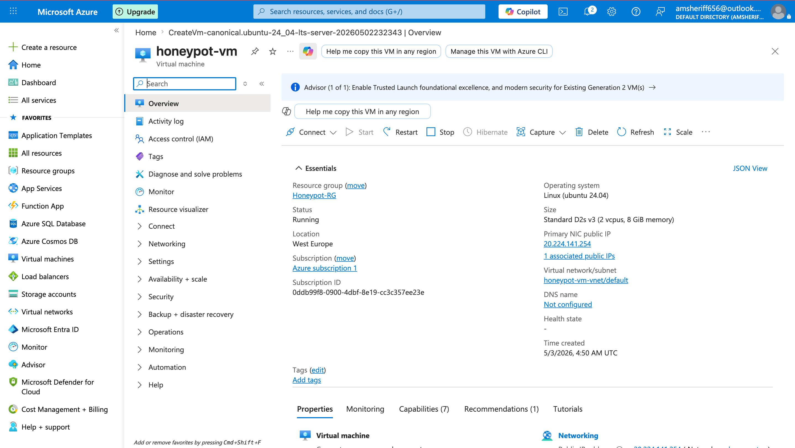

---

### Phase 2 — Network Security Group Configuration
- Configured NSG inbound rules to expose honeypot ports 1-64294 publicly to the internet
- Restricted SSH administrative access (port 64295) to personal IP only
- Restricted T-Pot web interface (port 64297) to personal IP only
- Denied all other SSH attempts from public internet

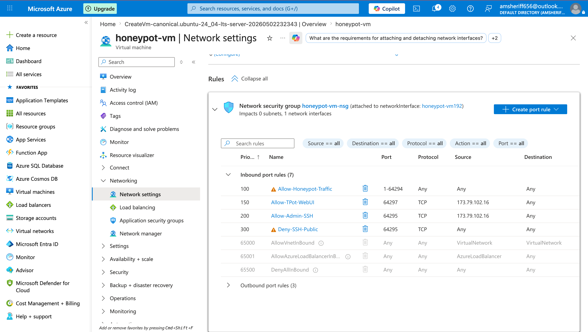

---

### Phase 3 — System Preparation & T-Pot Installation
- SSH'd into the VM and ran system update and upgrade
- Cloned the T-Pot repository from GitHub
- Ran the install script and selected Hive installation type
- Set web credentials for T-Pot dashboard access
- Successfully pulled all 160 Docker images required for full honeypot suite

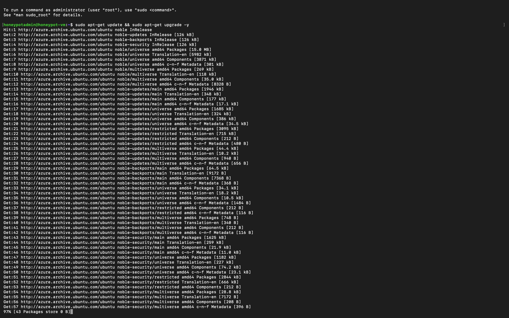

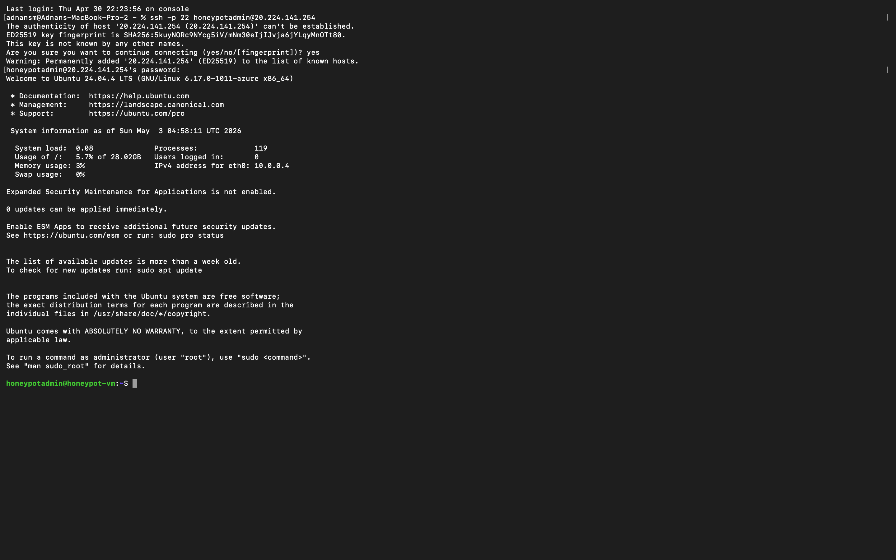

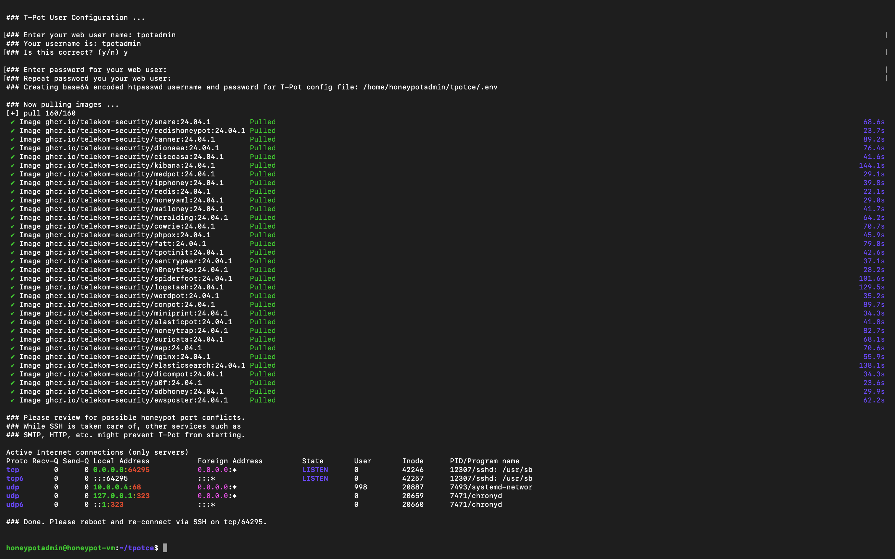

---

### Phase 4 — Telemetry Verification
- Rebooted VM and reconnected via SSH on new port 64295
- Confirmed T-Pot service active and running via systemctl
- Accessed T-Pot web GUI at https://[IP]:64297
- Verified all honeypot containers running and ingesting events into Elastic/Kibana

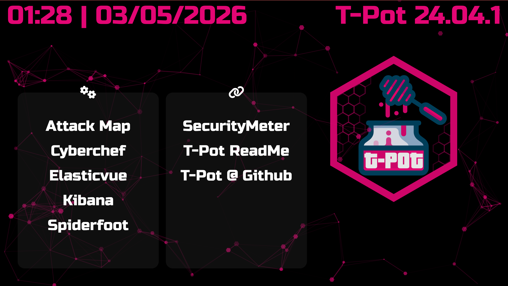

---

### Phase 5 — Attacker Activity Analysis
- Monitored live attack feed showing real-time inbound malicious traffic
- Analyzed source IPs by geolocation, reputation, and targeted services
- Identified scanning, brute-force, and Telnet-based attack behavior
- Investigated Suricata alert signatures and CVE probing attempts

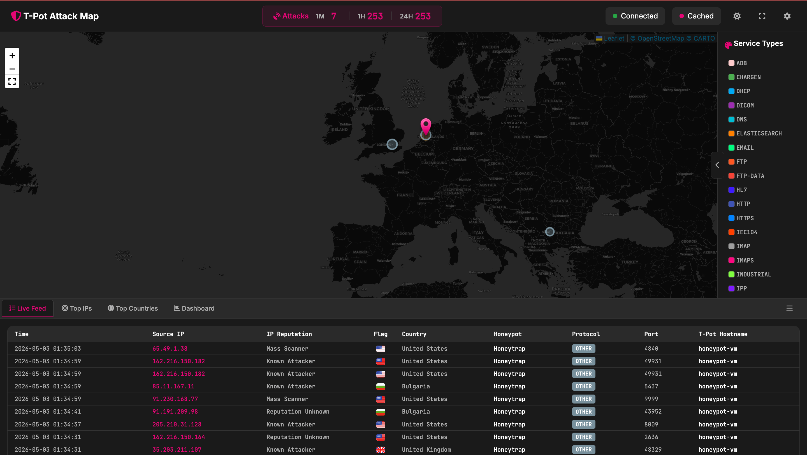


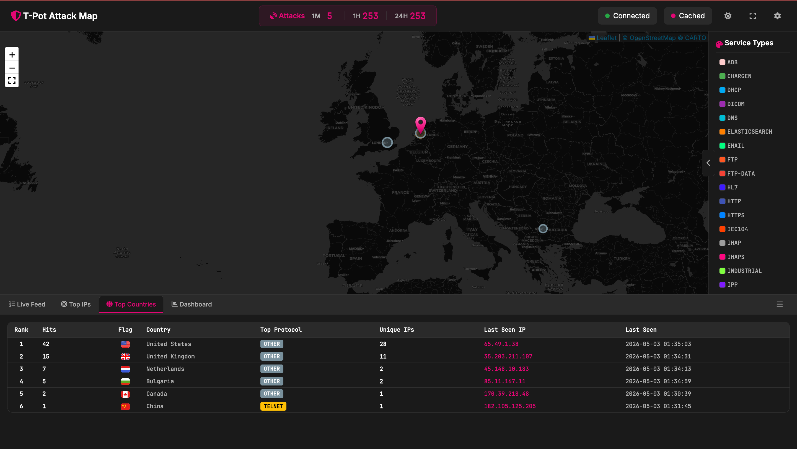

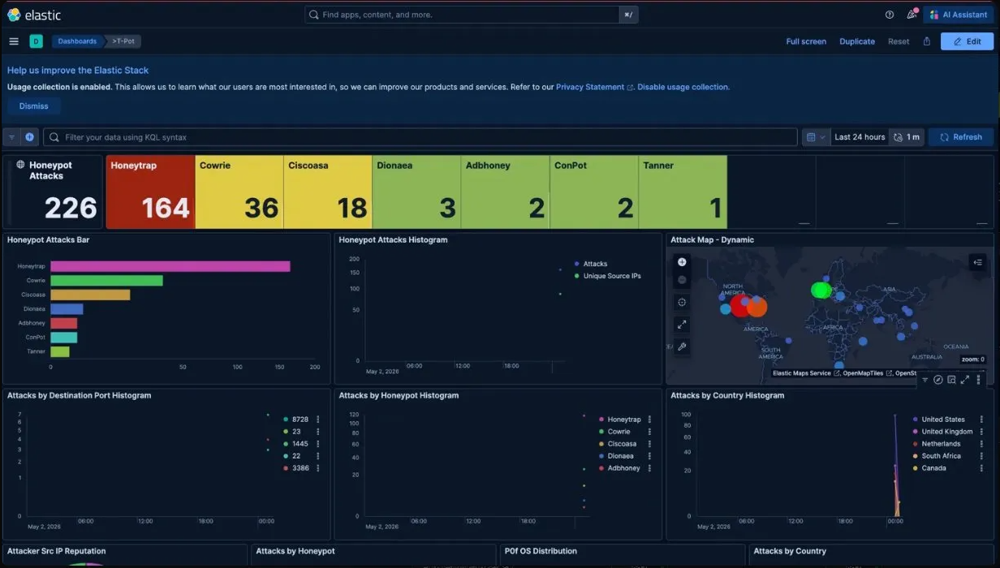

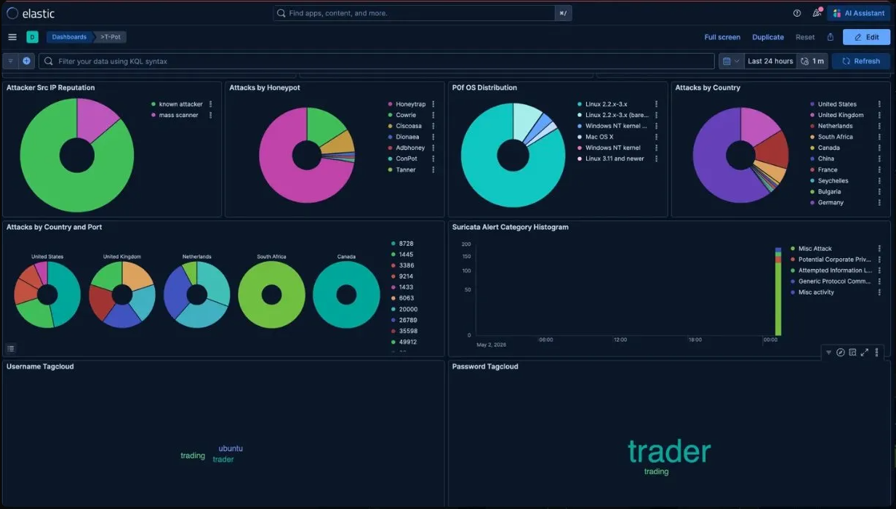

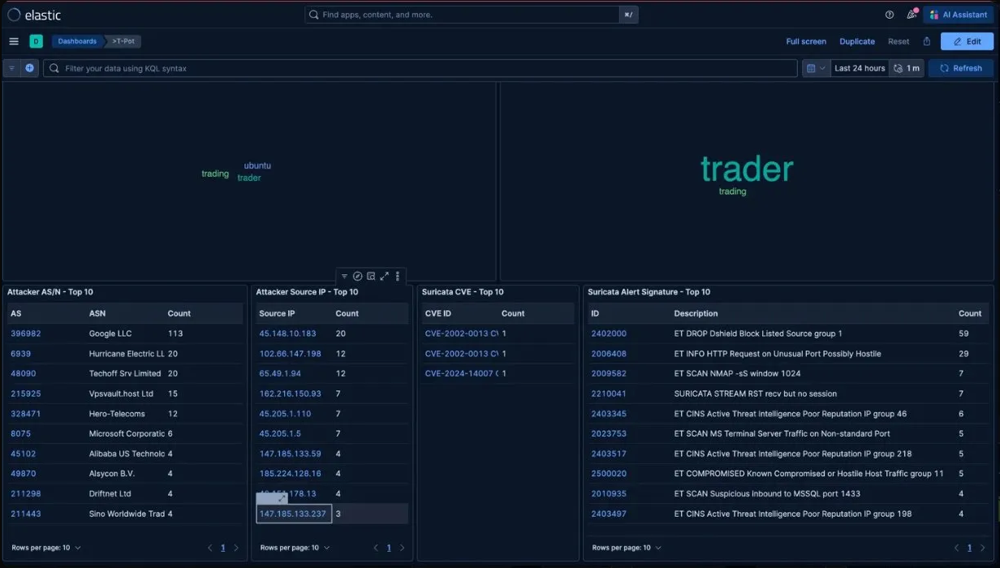

---

## Key Findings

| Finding | Detail |
|---|---|
| Total attacks (first hour) | 253 |
| Top attacking country | United States (42 hits, 28 unique IPs) |
| 2nd attacking country | United Kingdom (15 hits, 11 unique IPs) |
| Most targeted honeypot | Honeytrap (164 hits) |
| SSH brute force attempts | Cowrie captured 36 attempts |
| Top attacking ASN | Google LLC AS396982 (113 hits — cloud-based scanner) |
| CVEs probed | CVE-2002-0013, CVE-2024-14007 |
| Top Suricata alert | ET DROP DShield Block Listed Source (59 hits) |
| Attacker passwords attempted | "trader", "trading", "ubuntu" |
| Attack types observed | Port scanning, SSH brute force, Telnet probing, MSSQL enumeration |

---

## Skills Demonstrated

- Cloud infrastructure deployment (Microsoft Azure)
- Network security group configuration and access control
- Honeypot deployment and configuration (T-Pot 24.04.1)
- Linux administration (Ubuntu, SSH, systemctl, Docker)
- Log ingestion and analysis (Elastic/Kibana)
- Threat intelligence analysis (IP reputation, geolocation, ASN lookup)
- Attacker behavior identification (scanning, brute-force, CVE probing)
- Suricata IDS alert analysis
- Security documentation and GitHub version control

---

## Lessons Learned

- Internet-exposed systems are targeted within minutes of deployment — 253 attacks were recorded in the first hour alone
- The majority of attacking IPs originated from cloud infrastructure (Google LLC, Hurricane Electric), indicating automated scanning tools running on cloud VMs
- Attackers attempted common default credentials including "trader" and "ubuntu", highlighting the importance of strong authentication
- Deploying in the cloud rather than on-premises completely isolates the honeypot from personal infrastructure, eliminating personal IP exposure risk
- NSG rules provide granular access control that can precisely define which ports are exposed publicly versus restricted to trusted IPs

---

## References

- [T-Pot GitHub Repository](https://github.com/telekom-security/tpotce)
- [Microsoft Azure Documentation](https://docs.microsoft.com/en-us/azure)
- [Elastic/Kibana Documentation](https://www.elastic.co/docs)
